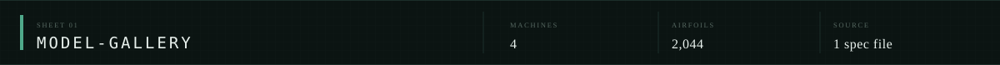
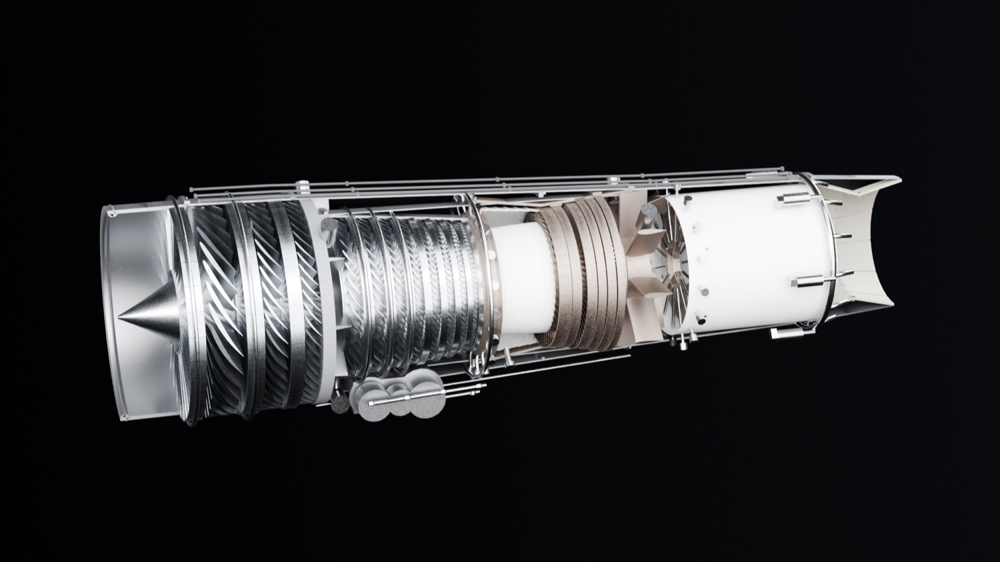
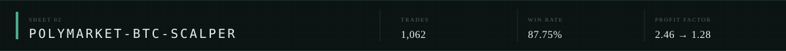
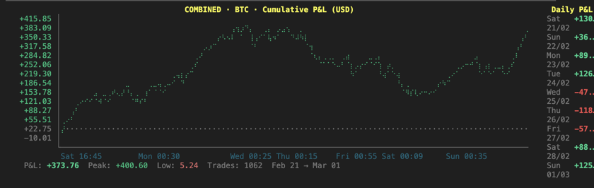
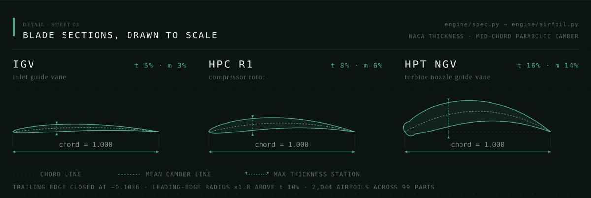

  

*Four machines — two engines and the vehicles built around them — each generated in Blender from a single specification file.*

*1,062 trades, 87.75% won, +$373.76 — with a stop that was meant to fill at 80¢ and filled at 67¢ instead.*

*The three sections on the cover, drawn from the engine's own generator — an inlet guide vane, a compressor rotor and a turbine nozzle guide vane, all to the same chord.*

