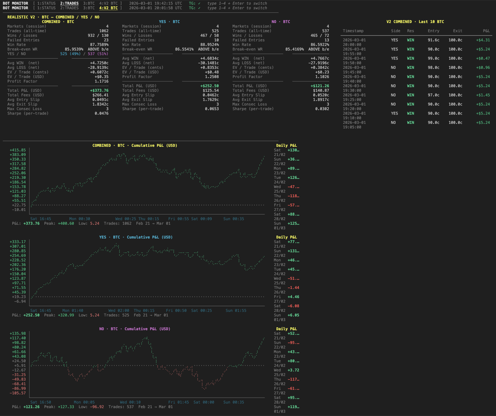

  

*Four machines — two engines and the vehicles built around them — generated in Blender from one specification file each.*

*An 88% win rate that lost its edge anyway: the stop was set at 80¢ and filled at 67¢.*

